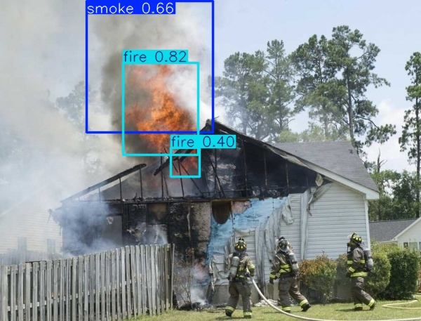

# Детекция огня и дыма с использованием YOLO11

## Описание проекта

Это репозиторий моего решения задачи детекции огня и дыма с помощью нейросетей. Обучающий набор, содержащий аннотации в формате COCO, преобразовывался в формат YOLO с отбором только нужных классов («дым» и «огонь»). Затем был сформирован конфигурационный файл с описанием директорий данных и параметров аугментации, что обеспечило разнообразие обучающих изображений и устойчивость модели к различным условиям съемки. Для решения задачи использовался предварительно обученный детектор YOLO11m из платформы Ultralytics, который дообучался в течение ста эпох с использованием GPU NVIDIA GeForce RTX 3060. Проведена оптимизация конфигурационного порога (confidence threshold), что позволило добиться наилучшего баланса между точностью и полнотой, а итоговая скорость инференса составила порядка 68 кадров в секунду, что делает систему пригодной для применения в режиме реального времени.

## Технологический стек
- **Фреймворк**: Ultralytics YOLO11 (PyTorch)
- **Формат данных**: COCO → YOLO конвертация
- **Аугментация**: Mosaic, Mixup, HSV-коррекция, повороты, отражения
- **Инфраструктура**:
  - GPU: NVIDIA RTX 3060 (12GB VRAM)
  - CUDA 11.8, cuDNN 8.9.2
- **Оптимизация**: Автоматический подбор batch size, AdamW

## Этапы реализации

### 1. Подготовка данных
- Конвертация аннотаций COCO в YOLO-формат:
```python
convert_coco_to_yolo(
    coco_json_path="data/474_fire_val/annotations/instances_default.json",
    output_dir="labels",
    target_classes=[4, 5]  # 4=smoke, 5=fire
)
```
- Сохранение структуры подпапок (train/val)
- Фильтрация нецелевых классов
### 2. Конфигурация модели
- Архитектура: YOLO11m (средний размер)
- Параметры аугментации:
```yaml
hsv_h: 0.015
hsv_s: 0.7
hsv_v: 0.4
degrees: 45
translate: 0.1
scale: 0.5
shear: 0.0
perspective: 0.0001
flipud: 0.0
fliplr: 0.5
mosaic: 1.0
mixup: 0.1
```
### 3. Обучение
- Transfer Learning
- Гиперпараметры:
    - Epochs: 100
    - Batch Size: 14 (автоподбор)
    - Оптимизатор: AdamW (lr=0.01)
    - Разрешение: 640x640 px
### 4. Оптимизация
- Поиск оптимального confidence threshold (0.56)
- Анализ метрик по классам:

| Объект | Precision | Recall | mAP50 |
|--------|-----------|--------|-------|
| smoke  | 0.81      | 0.23   | 0.31  |
| fire   | 0.82      | 0.36   | 0.30  |

### 5. Тестирование
- Скорость: 68.10 FPS (RTX 3060)
- Потребление памяти: 9.5 GB VRAM
- Пример инференса:
```python
model.predict('1_23.jpg', save=True)
```

